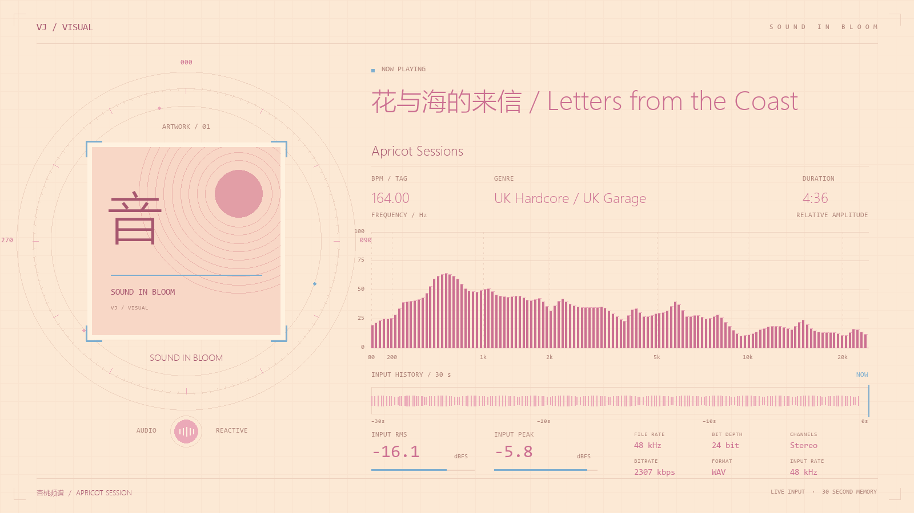

# VJVision

本 fork 基于 [ichiryu0021/VJVision](https://github.com/ichiryu0021/VJVision)，保留作者的识别与退出流程修复，并新增杏桃频谱主题、实时输入历史、文件元数据展示及独立环境启动入口。



预览使用示例音频数据。安装和主题说明见 [本地运行指南](docs/local-setup.md)。原作者 Releases 中的程序不包含本 fork 的新增功能。

> 实时音频识别 + 音频响应可视化，专为 DJ 现场设计。

VJVision 监听 DJ 台的输出音频，自动识别当前播放的曲目，并在第二块屏幕（投影/LED 墙）上展示随音乐律动的频谱与专辑封面动画。

## 功能特性

- **自动曲目识别**：基于 Dejavu 音频指纹算法，实时识别正在播放的歌曲（支持 12 秒采样窗口）
- **音频响应可视化**：pygame 渲染的频谱柱、波形、镜像三种样式，封面随节拍旋转
- **混音过渡脉动**：检测到 DJ 切歌/混音时，视觉进入脉动过渡状态，平滑切换到下一首歌
- **多显示器支持**：控制界面在主屏，可视化窗口投放到副屏
- **便携部署**：打包为单个 exe，带上 `data/` 文件夹即可在任意机器上运行（含已分析的指纹库）

## 系统要求

| 项目 | 要求 |
|------|------|
| 操作系统 | Windows 10 / 11 |
| Python（开发用） | 本 fork 使用 Python 3.11 验证 |
| 音频输入 | 支持 WASAPI / DirectSound / MME 的声卡或虚拟音频线 |
| 显示器 | 至少 1 块；推荐 2 块（控制 + 投影） |

## 快速开始（exe 用户）

1. 从 [Releases](https://github.com/ichiryu0021/VJVision/releases) 下载最新 `VJVision.exe`
2. 双击运行，首次启动会在 exe 同级目录生成 `data/` 文件夹

### 使用流程

```
添加曲库 → 分析指纹 → 选择音频设备 → 开始捕获 → 看副屏可视化
```

1. **曲库准备**
   - 点击「+ 添加文件夹」选择音乐目录，或「+ 添加文件」逐个添加
   - 支持格式：`.flac` `.wav` `.mp3` `.aiff` `.aif` `.ogg`
   - 点击「分析队列」开始生成音频指纹（首次分析较慢，之后增量）
   - 分析完成后状态显示「曲库：N 首歌」

2. **音频设备**
   - 在「音频设备」下拉框选择监听 DJ 输出的设备（如声卡输入或虚拟音频线）
   - 观察「输入电平」表，确认有信号输入

3. **可视化**
   - 「可视化显示」选择副屏（默认第 2 块显示器）
   - 可设频谱样式（柱/波形/镜像）、旋转速度、是否随节拍旋转
   - 可上传待机 LOGO 图片（识别到第一首歌前显示）

4. **开始**
   - 点击「开始捕获」，副屏即出现可视化窗口
   - 播放音乐，几秒后自动识别并显示歌曲封面

## 从源码运行

```bash
git clone https://github.com/v3lmelt/VJVision.git
cd VJVision
py -3.11 -m venv .venv
.\.venv\Scripts\python.exe -m pip install -r requirements.txt
.\.venv\Scripts\python.exe -m pip install --no-deps -r requirements-dejavu.txt
.\start.bat
```

## 打包 exe

```bash
python -m PyInstaller VJVision.spec --noconfirm --clean
# 产物：dist/VJVision.exe
```

或使用一键发布脚本（构建 + 提交 + 推送 + 创建 GitHub Release）：

```powershell
.\release.ps1 -Version 1.1.4 -Notes "修复 xxx"
```

## 数据目录说明

| 路径 | 说明 | 便携性 |
|------|------|--------|
| `data/fingerprints.db` | 音频指纹库（SQLite） | ✅ 随 exe 迁移 |
| `data/song_paths.sqlite` | 歌曲 ID → 文件路径索引 | ✅ 随 exe 迁移 |
| `data/covers/` | 专辑封面缓存 | ✅ 随 exe 迁移 |
| `data/vjvision.log` | 运行日志 | ✅ 随 exe 迁移 |
| `%APPDATA%/VJVision/prefs.json` | 音频设备、显示器等本机偏好 | ❌ 每台机器独立 |

> 在 A 电脑分析完曲库后，把 `VJVision.exe` + `data/` 一起拷到 U 盘，插到 B 电脑即可直接使用，无需重新分析。

## 识别参数说明

在 `vjvision/config.py` 的 `CaptureConfig` 中可调整：

| 参数 | 默认值 | 说明 |
|------|--------|------|
| `match_seconds` | 12 | 每次识别采样时长（秒）。过短会降低置信度 |
| `match_interval` | 4 | 识别间隔（秒）。混音期间会自动减半 |
| `match_confirmations` | 2 | 连续命中几次才切歌，防止误判 |
| 首歌确认阈值 | 0.25 | 第一首歌需达到此置信度才确认 |
| 切歌确认阈值 | 0.30 | 后续歌曲需达到此置信度才切换 |

## 常见问题

**Q：识别不到歌曲？**
- 检查输入电平表是否有信号
- 确认该歌曲已在曲库中并分析完成
- 查看 `data/vjvision.log` 中的置信度数值，低于 0.25 通常是音量过低或音频质量差

**Q：不支持 m4a / aac？**
- 当前使用 libsndfile 解码，原生不支持 m4a/aac。建议转成 flac 或 mp3 后再分析。

**Q：切歌反应慢？**
- 长混音（cross-fade）期间两首歌重叠，置信度爬升较慢，属正常现象
- 可降低 `match_interval` 或切歌阈值提高响应速度，但会增加误判风险

**Q：关闭控制台后可视化窗口没关？**
- v1.1.1+ 已修复：可视化子进程会检测父进程存活，主进程退出后自动关闭

## 技术架构

```
main.py
├── VisualizerManager  →  pygame 子进程（副屏可视化）
├── MatcherThread      →  音频采集 + Dejavu 识别 + 元数据
└── DebugUI            →  CustomTkinter 控制面板（主线程）
```

- 进程间通信：`multiprocessing.Queue`
- 指纹算法：Dejavu（声学指纹 + 哈希匹配）
- 音频解码：soundfile（libsndfile，支持 24-bit FLAC）

## 版本历史

见 [RELEASE_NOTES.md](RELEASE_NOTES.md)。

## License

MIT
