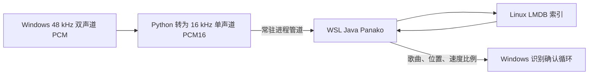

# 在 Windows 上调用 Panako

后续已完成不使用 WSL 的 Windows x64 原生验证，见 [Panako Windows 原生运行与跨平台适配](panako-native-windows-2026-09-09.md)。本文保留此前 WSL 路线的实验记录。

本仓库已实现并验证 Windows Python → WSL Ubuntu → 常驻 Java Panako 的离线调用通路。JGaborator 原生库在 Linux 侧加载，指纹使用 Linux 文件系统内的 LMDB 保存。Windows 原生应用仍负责采集和显示，测试工具通过标准输入输出传递音频和识别结果。

这项实现位于 `tools/`，尚未接入 `main.py` 的索引、设备采集和应用生命周期，也未生成新版 EXE。

## 已验证的通路



`PanakoStreamServer.java` 使用预解码 PCM，替换 TarsosDSP 的解码入口，因此识别请求不启动 FFmpeg、不写查询音频文件。由于 TarsosDSP 会先检查文件是否可读，服务在自己的目录中建立可复用的空文件别名；音频内容始终来自请求缓冲区。

`panako_wsl_client.py` 启动一个隐藏的 `wsl.exe` 子进程，维持同一个 JVM。服务不监听网络端口，也不依赖 WSL 的 localhost 转发。标准输出仅用于 JSON 回复，原生库日志单独保存。退出时发送关闭命令并关闭 LMDB。

本机使用 Panako 官方 2.1 JAR、Temurin Linux JRE 11.0.32.1、Ubuntu WSL。数据库以 LMDB 模式打开，未使用旧原型的内存存储。已完成建库后关闭 JVM、启动新 JVM、查询相同音频的检查，返回的候选、匹配数、位置和速度比例一致。

检查本机 JAR 的原生资源发现，其中包含 `jni/libjgaborator.so` 和 `jni/libjgaborator.dylib`，没有对应的 Windows DLL。Java 程序本身能够跨平台，不代表随包的音频分析原生库也能直接在 Windows 加载。

版本组合需固定，不能仅把 Java 换成任意新版。当前依赖在 Java 11 下能运行，日志包含旧版 lmdbjava 的反射访问提示；更新运行时应重新验证原生加载、存储和查询。

## 本机复现

在仓库根目录使用已准备好的依赖编译 Java 桥接程序：

```powershell
& 'C:/Program Files/Java/jdk-11.0.12/bin/javac.exe' --release 11 -cp cache/engine-panako/Panako-2.1-all.jar -d cache/engine-panako tools/PanakoStreamServer.java
.\.venv\Scripts\python.exe tools/benchmark_panako_application.py
```

工具默认使用此前 Olaf benchmark 保存的同一批参考曲目及独立数据库副本，重新运行当前 Dejavu、相同接受条件 Dejavu 和 Panako 三组测试，不复用旧计时结果。前置文件为 `cache/olaf-application.json` 及其中记录的测试目录。歌曲内容通过 SHA-256 校验。

可以通过 `--distro`、`--java`、`--classes`、`--tracks`、`--reference-report` 和 `--output` 指定本机路径。Java 必须是 Linux 运行时；`--java` 参数接收它在 Windows 挂载盘上的路径，客户端转换为 `/mnt/<drive>/...`。

测试在 WSL `/tmp/vj-panako-*` 中建立独立 LMDB，Windows 原数据库不作修改。这个目录用于实验隔离，可能随系统清理消失；正式运行需要改用 Linux 用户数据目录，例如 `~/.local/share/vjvision/panako`。不要把基准的临时目录直接作为正式曲库。

## 接入正式应用还需要的工作

- 在安装或首次启动时验证 WSL、指定发行版和固定版本 Java，显示建库与服务状态。
- 应用启动时预热工作进程，退出时关闭，异常时终止失效请求并重启；重启后清除上一轮待确认候选。
- 由后台队列串行写入 LMDB，维护参考歌曲 ID 与 Windows 文件路径映射，提供增删、重建和恢复流程。
- 保留现有 Dejavu 数据库。旧指纹不能直接转换成 Panako 指纹，重新建库需要原始歌曲；当前只有六首参考音频可用，不能因此丢失其余已索引歌曲。
- 将 PCM 传输放在识别线程，避免阻塞 Tkinter 主线程，并明确长查询超时后的行为。
- 在真实采集设备、完整曲库、WSL 冷启动、系统重启和打包环境中验证。

当前桥接是单请求串行的 benchmark 工具。回复等待有超时，但阻塞写入、自动重连和崩溃恢复尚未形成生产级控制流程。测试只证明可行的本地接入方式和已测场景，不代表完成一键安装部署。

本次还实测发现原生 LMDB 删除后残留指纹的问题：`processDeleteQueue()` 读取了错误的队列，后续匹配可能指向已删除元数据。benchmark 已改用独立重建的五首曲库完成留出测试；服务协议中的删除操作仅用于复现该故障，不应当作可用的曲库维护接口。正式部署需要使用重建后切换，或先修复并验证上游删除逻辑。

## 为什么先使用 WSL

[Panako 官方说明](https://github.com/JorenSix/Panako#limitations)目前仍列出 Windows 支持限制，并提供 WSL 或 Docker 路线。本机此前 Windows 原生启动因缺少 JGaborator JNI 库失败；本次通过 Linux 侧加载该依赖，保留现有 Java 核心。

纯 Windows 方案需要准备兼容 JVM 的 JGaborator DLL，并验证 JNI、存储依赖和解码路径。它值得在确认识别收益之后评估，目前没有经过本仓库的构建与打包测试。WSL 路线已经能做实际性能对照，代价是用户机器上多出 Linux 运行环境。
